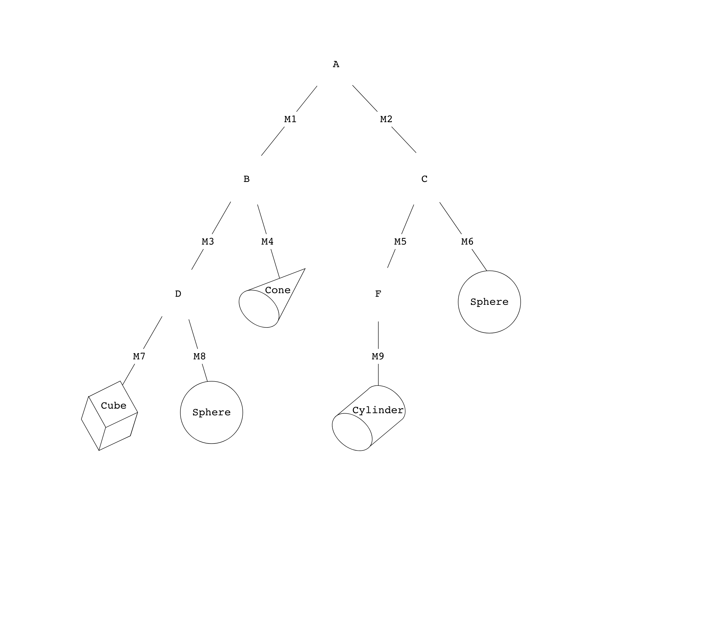
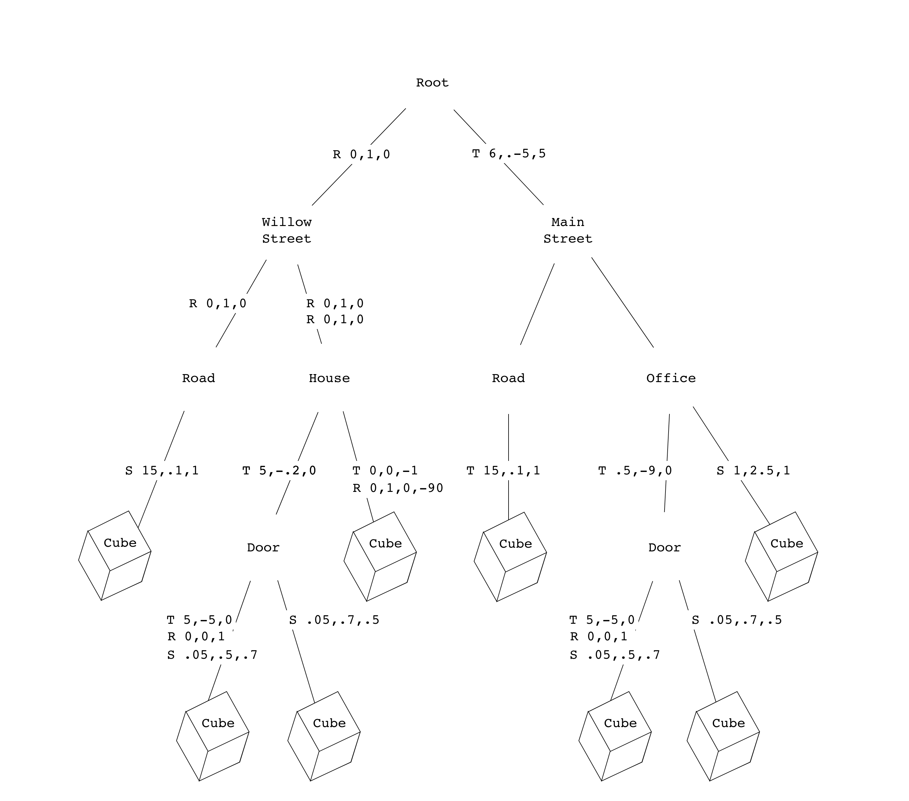

# Lab 5: Parsing

## 1.1. Introduction

In this lab, you will learn how to work with **scene files** to load all the information you need to render a 3d scene. In particular, you will learn how lights and cameras are represented, as well as how to read **transformation graphs** so that every object has the correct size and position in the scene. You will use the code you’ve written in this lab for the upcoming assignments, including the Ray and Realtime projects!

## 2. Understanding Scene Files

To visualize a compelling 3d scene, we need data about the lights, camera, textures, surfaces and geometry. This section will go over the conceptual aspects of how these are represented.

### 2.1. Lights

### 2.2. Camera

### 2.3. Geometry and Transformation Graphs

To save memory, we will use only a small number of objects which are then repeated and modified using transformations. The final placement of the geometry (representing objects, people, or just about anything else) can be particularly overwhelming, because we need to manage many different transformations like scaling, rotation or translation. Often, many (but not all) of the same transformations are applied to many objects in the scene.

<details>
  <summary>Example of a cityscape</summary>
If our scene is a city, it would be senseless to describe the positions of all the windows by their distance from the center of the city. It would be much more sensible to describe each window's position relative to the building it is part of, and describe the building's position relative to its neighborhood, and finally the neighborhood's position relative to the center of the city.
</details>

To handle the objects and their transformations, we can define nested groupings of geometry that compose our scene. This is particularly helpful for managing the transformation matrices of objects in a compact way.

<details>
  <summary>Example of a cityscape continued</summary>
In our city, we can define a first grouping as the neighborhoods, which can themselves be made up of sub-groupings consisting of buildings, which can be made of further sub-groupings of windows, doors and roofs, until we get to the primitives like cubes, pyramids, and cylinders. 
</details>

We can represent the objects in a scene and their transformations as a directed acyclic graph, which we will call a scene graph or **transformation graphs**.

Consider the graph below that represents four primitives in a scene (two spheres, one cube, one cone and a cylinder found on the leaf nodes). Transformation matrices (denoted M1, M2, etc.) are represented on the branches of the graph. All nodes that are not leaf nodes are also called **transblocks** and can be thought of as groupings of objects as mentioned above.




**Task 1. a. Order of Multiplication**
Write the cumulative matrix for each of the primitives (leaf nodes) in terms of matrices M1, M2, etc. Your answer should be a product of matrices.


Now consider the graph below. Instead of transformation matricies M1, M2, etc. we now have individual transformations such as Scaling, Translation and Rotation. These are written in the form S, T and R followed by the parameters needed for each transformation. For example S(15,.1,1) scales by 15 in the x direction, by .1 in the y direction and by 1 in the z direction. Note that Rotations have four parameters, the first three describing the axis of rotation in terms of x,y and z axes, and the last parameter describing the angle of rotation in degrees.

Like before, only the leaves of this tree contain any real geometry in the form of primitives (cube, sphere, etc). 
<details>
  <summary>What scene does this graph actually represent?</summary>
It represents a simplified version of our city example. We have divided our model into two districts (Willow Street and Main Street). Each of these districts has a road which is made of one cube that is stretched in the x and squished in the y, as well as a building. Each building is made up of a cube and a door, which is also made up of two cubes! In total we have 8 primitives, all of which are cubes. 
</details>

The letters S, T and R describe transformations applied to the children nodes.
```S(15, .1,1)```
<details>
  <summary>What does the notation like </summary>
We have divided our model into two districts (Willow Street and Main Street). Each of these districts has a road which is made of one cube that is stretched in the x and squished in the y, as well as a building. Each building is made up of a cube and a door, which is also made up of two cubes! In total we have 8 primitives, all of which are cubes. 
</details>
S stands for Scale, T for Transformation, R for Rotation, and the numbers in parentheses. 
 



Remember how in the transforms lab you learned how to compose a series of rotation, scaling and translation matricies into a single transformation matrix? In order to transform each primitive to its final place, you will need one of these transformation matrices for each of the primitives in your scene.
Keep in mind that order matters when multiplying matricies!


**Task 2. a. Order of Multiplication of Individual Transformations**
For two Cubes of your choice, write down the order in which the three matricies should be applied. You can write each matrix in the form S(0, 6, .1) where S is the type of transformation (S for Scale, T for Translation, R for Rotation) and the parameters

**Task 2. b. Building the Final Transformation Matrices**
For cubes 1, 3 and 8, write the final transformation matrix in terms of a product of matrices T, R, S, etc., as needed. You can use the same notation as 1. a.

**Task 3. Navigating the Scene Graph Efficiently**

In the previous exercise, you might have seen how some matrix multiplications repeat throughout different objects.
Explain why traversing a scene graph from the root node every time each object is rendered is inefficient. Now consider how you might build the final transformation matricies using depth first search.
Explain how your approach is better in terms of time complexity, and write pseudocode for it.


## 3. Implementing a Scene Parser

In this section, you will load in the lights, camera and scene data. You will also implement a depth first search to generate the final transformation matrices for each matrix. To do this, you will be filling in out a struct called CS123SceneMetaData in `CS123SceneLoader::load`, based off of data found in the scene provided by a SceneData struct (SceneData.h).

### 3.1. Understanding SceneData.h

Throughout this course, we will use a CSCI1230-specific scene file format to describe a scene. Our scene file contains necessary information of a scene, namely global data, camera data, light data, and object data. You should refer to this document to understand scene files and scene graphs in detail.

### 3.2. Implementing CS123SceneLoader::load()
  **Explain the sencil structure, what files do the parsing, what functions to fill in.**
  Behind the scenes, we have parsed out all this data nicely and you can find it in SceneData.h
  
### 3.2.1 Global data Camera Data
  In load(), you will need 
  These are found in the parser member variables.
  
### 3.2.2 Lights
  Array of structs

### 3.2.3 Read the matrix of the root
  Call fsParseSceneNode() in load().
  Check that you are correctly printing out the transformation matrix. **Print out the matrix & provide it so they can check**
  In order to make a matrix from a vec::3, you will need to call GLM::rotate, translate, scale. For rotate in particular, look at SceneData.h angle, and rotate.
  
### 3.2.3 Depth-first search recusively 
  
Whenever we would like to load a scene, we can call `CS123SceneLoader::load`. Since this is a class method, there is no need to create any new `CS123SceneLoader` instance. 

The stencil code already covers the parsing for the XML scene file and what you should do is to create the scene meta-data based on the information inside the parser. In the load function, a new parser instance will be created and try to parse the given file. Upon success, all information will be available via the `CS123ISceneParser` interface.

In `CS123SceneLoader::load`, you should obtain the global data for the scene, the camera data and the lighting. You should also traverse through the primitive tree and calculate the cumulative transformation matrix for each of them. All data described above can be packed into a `CS123SceneMetaData` structure as a unified interface for you to create your own scene for your future assignments.

### 3.3 Testing scenes
  You should have a completed parser that can load all of the scene files. Be prepared to load the things in increasing complexing.
  You can run
  It will print to console but also show you a visual
  
  
### 4. Checkoff
To be checked off, you shoudl have your answers to conceptual questions ready (Tasks 1 through 3).
You should also be able to print out the correct matrices and show a visual of the scene.
  
## 6. (Optional) Creating your own 3-d scenes

You might want to work with the scene files directly for a final project, in order to create your own 3-d scenes. You can use this lab as a starting point and reference on how to do that. Below we will describe how the .xml format works, so you can understand how all the data mentioned above is actually written in the scene files.
Description of the .xml format
  
