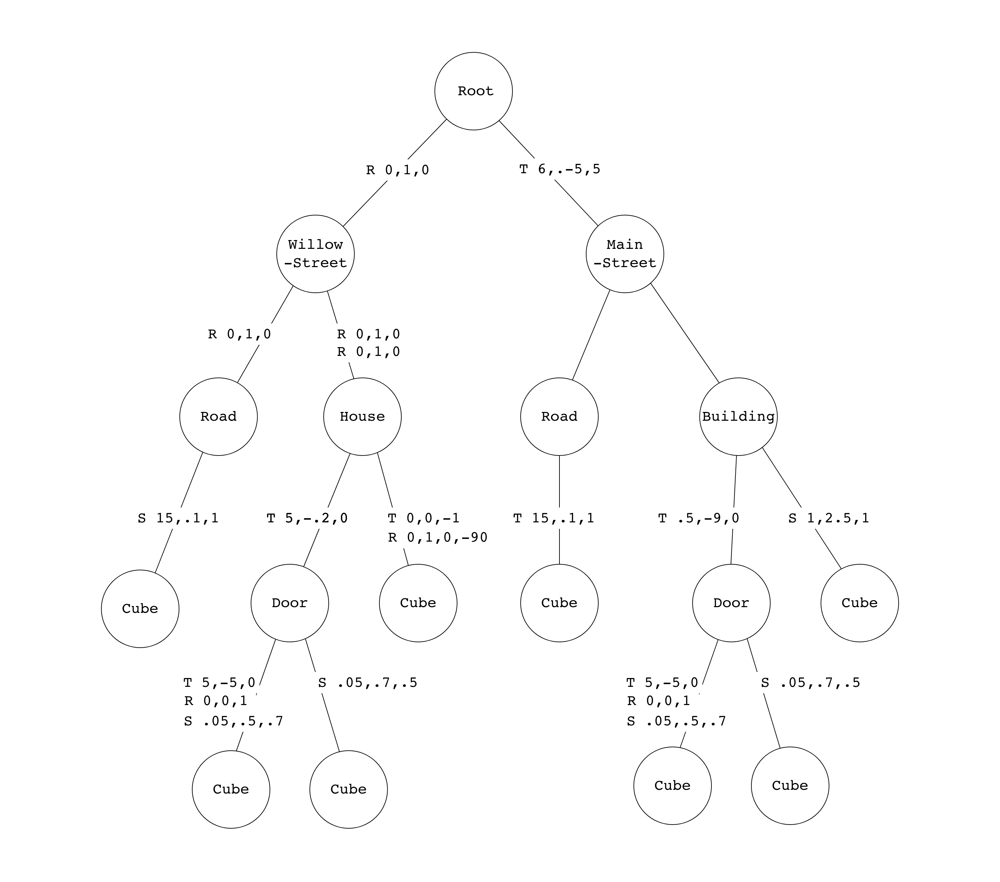

# Lab 5: Parsing

## 1. Introduction

In this lab, you will learn how to work with **scene files** to load all the information you need to render a 3d scene. In particular, you will learn how to read **transformation graphs** so that every object has the correct size and position in the scene. You will need the code you’ve written in this lab for the upcoming assignments!

## 2. Problem Statement

To visualize a compelling 3d scene, we need data about the camera, lights, textures, surfaces and geometry. The final placement of the geometry (representing objects, people, or just about anything else) can be particularly overwhelming, because we need to manage many different transformations like scaling, rotation or translation. Often, many (but not all) of the same transformations are applied to many objects in the scene. We need a good data structure to manage this!

  
Example of a cityscape

If our scene is a city, it would be senseless to describe the positions of all the windows by their distance from the center of the city. It would be much more sensible to describe each window's position relative to the building it is part of, and describe the building's position relative to its neighborhood, and finally the neighborhood's position relative to the center of the city.

## 3. Understanding Transfromation Graphs

To handle the objects and their transformations, we can define nested groupings of geometry that compose our scene. This is particularly helpful for managing the transformaton matricies of objects in a compact way.

  
Example of a cityscape continued

In our city, we can define a first grouping as the neighborhoods, which can themselves be made up of sub-groupings consisting of buildings, which can be made of further sub-groupings of windows, doors and roofs, until we get to the primitives like cubes, pyramids, and cylinders. 

We can represent the objects in a scene and their transformations as a directed acyclic graph, which we will call a scene graph or **transformation graphs**.
 

The above scene graph has 8 primitives, all of which are cubes. The letters T, R and S describe transformations applied to the children nodes. You will need to multiply the corresponding matricies (see last week's the transforms lab), to produce a final transformation matrix that will put each primitive where it needs to be in the scene. Remember, from the transfroms lab, that the order of matrix multiplication matters.

**Task 1. Building the Transformation Matrices**

For each primitive object, write down its final transformation matrix in terms of a product of matrices M1, M2, M3, etc., as needed.

**Task 2. Navigating the Scene Graph Efficiently**

In the previous exercise, you might have seen how some matrix multiplications repeat throughout different objects. Explain why traversing a scene graph from the root node every time each object is rendered is inefficient and propose a more efficient approach. Explain how your approach is better in terms of time complexity, and write pseudocode for it.

## 4. Implementing a Scene Parser

Now, you are ready to implement the static `CS123SceneLoader::load` method in the provided stencil.

### 4.1. Understanding the CSCI1230-specific Format

Throughout this course, we will use a CSCI1230-specific scene file format to describe a scene. Our scene file contains necessary information of a scene, namely global data, camera data, light data, and object data. You should refer to this document to understand scene files and scene graphs in detail.

### 4.2. Implementing CS123SceneLoader::load()

Whenever we would like to load a scene, we can call `CS123SceneLoader::load`. Since this is a class method, there is no need to create any new `CS123SceneLoader` instance. 

The stencil code already covers the parsing for the XML scene file and what you should do is to create the scene meta-data based on the information inside the parser. In the load function, a new parser instance will be created and try to parse the given file. Upon success, all information will be available via the `CS123ISceneParser` interface.

In `CS123SceneLoader::load`, you should obtain the global data for the scene, the camera data and the lighting. You should also traverse through the primitive tree and calculate the cumulative transformation matrix for each of them. All data described above can be packed into a `CS123SceneMetaData` structure as a unified interface for you to create your own scene for your future assignments.
