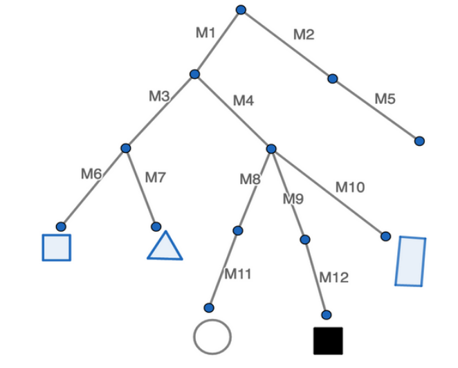

# Lab 5: Parsing

## 1. Introduction

In this lab, you will learn how scene graphs work and how to load them, so that every object is in the correct location in the scene. You will need the code you’ve written in this lab for the upcoming assignments!

## 2. Problem Statement

In order to visualize a compelling 3-dimensional scene, we need to manage tons of complex geometries that represent objects, people, or just about anything else. To manage all this geometry, we need a way of describing the position of shapes relative to other shapes. If our scene is a city, it would be senseless to describe the position of all the windows in all the buildings by their distance from the center of the city. It would be much more sensible to describe each window's position relative to the building it is on, and describe the building's position relative to the neighborhood or road, and finally the reighborhood's position relative to the center of the city.

## 3. Understanding Scene Graphs

To solve this, we can define groupings of geometry that compose our scene (neighborhoods, roads), which can themselves be made up of sub-groupings (a house, an office building, a sidewalk), which can be made of further sub-groupings (windows, doors, roofs), until we get to the primitives (cubes, pyramids, cylinders). Since such groupings can be nested, our representation of objects in a scene will form a directed acyclic graph, which we will call a scene graph.
 

The above tree representation of a nested scene graph has 5 primitives. Transformation matrices, (named as M1, M2, and so on), describe the transformations to be applied subsequently. The empty leaf node without any children represents a “tree” transblock with no sub-transblocks.

**Task 1. Getting the Final Transformation Matrices **

For each primitive object, identify its final transformation matrix, represented in the form of matrix multiplication.

**Task 2. Navigating the Scene Graph Efficiently **

In the previous exercise, you might have noticed that some matrix multiplications repeat throughout different objects. Explain why traversing a scene graph from the root node every time each object is rendered is inefficient and propose a more efficient approach. Explain how your approach is better in terms of time complexity, and write pseudocode for it.

## 4. Implementing the Scene Loader

Now, you are ready to implement the static `CS123SceneLoader::load` method in the provided stencil.

### 4.1. Understanding the CSCI1230-specific Format

Throughout this course, we will use a CSCI1230-specific scene file format to describe a scene. Our scene file contains necessary information of a scene, namely global data, camera data, light data, and object data. You should refer to this document to understand scene files and scene graphs in detail.

### 4.2. Implementing CS123SceneLoader::load()

Whenever we would like to load a scene, we can call `CS123SceneLoader::load`. Since this is a class method, there is no need to create any new `CS123SceneLoader` instance. 

The stencil code already covers the parsing for the XML scene file and what you should do is to create the scene meta-data based on the information inside the parser. In the load function, a new parser instance will be created and try to parse the given file. Upon success, all information will be available via the `CS123ISceneParser` interface.

In `CS123SceneLoader::load`, you should obtain the global data for the scene, the camera data and the lighting. You should also traverse through the primitive tree and calculate the cumulative transformation matrix for each of them. All data described above can be packed into a `CS123SceneMetaData` structure as a unified interface for you to create your own scene for your future assignments.
