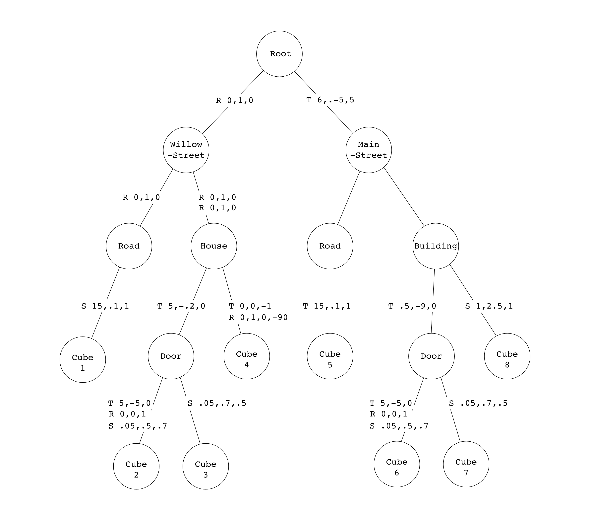

# Lab 5: Parsing

## 1. Introduction

In this lab, you will learn how to work with **scene files** to load all the information you need to render a 3d scene. In particular, you will learn how to read **transformation graphs** so that every object has the correct size and position in the scene. You will need the code you’ve written in this lab for the upcoming assignments!

## 2. Problem Statement

To visualize a compelling 3d scene, we need data about the camera, lights, textures, surfaces and geometry. The final placement of the geometry (representing objects, people, or just about anything else) can be particularly overwhelming, because we need to manage many different transformations like scaling, rotation or translation. Often, many (but not all) of the same transformations are applied to many objects in the scene. We need a good data structure to manage this!

  
Example of a cityscape

If our scene is a city, it would be senseless to describe the positions of all the windows by their distance from the center of the city. It would be much more sensible to describe each window's position relative to the building it is part of, and describe the building's position relative to its neighborhood, and finally the neighborhood's position relative to the center of the city.

## 3. Understanding Transfromation Graphs

To handle the objects and their transformations, we can define nested groupings of geometry that compose our scene. This is particularly helpful for managing the transformaton matricies of objects in a compact way.

  
Example of a cityscape continued

In our city, we can define a first grouping as the neighborhoods, which can themselves be made up of sub-groupings consisting of buildings, which can be made of further sub-groupings of windows, doors and roofs, until we get to the primitives like cubes, pyramids, and cylinders. 

We can represent the objects in a scene and their transformations as a directed acyclic graph, which we will call a scene graph or **transformation graphs**.
The graph below represents a simplified version of our city example. The nodes separate objects that have different transformations applied to them. On the branches, we showed the exact transformations to be appled to all of the geometry downstream. These are written in the form S, T or R along with the  Only the leaves of this tree contain any real geometry in the form of primitives (cube, sphere, etc).

  
How does the graph represent a model of a city?

We have devided our model into two districts (Willow Street and Main Street). Each of these districts has a road which is made of one cube that is stretched in the x and squished in the y, as well as a building. Each building is made up of a cube and a door, which is also made up of two cubes! In total we have 8 primitives, all of which are cubes. 

**Add a simplfied matrix**
Questions with just one matrix per branch; then build up to example.

The letters T, R and S describe transformations applied to the children nodes.
 

Remember how in the transforms lab you learned how to compose a series of rotation, scaling and translation matricies into a single transformation matrix? In order to transform each primitive to its final place, you will need one of these transformation matrices for each of the primitives in your scene.
Keep in mind that order matters when multiplying matricies!

**Task 1. a. Order of Multiplication**
For the Cube 2, write down the order in which the three matricies should be applied. You can write each matrix in the form S(0, 6, .1)

**Task 1. b. Building the Final Transformation Matrices**
For cubes 1, 3 and 8, write the final transformation matrix in terms of a product of matrices T, R, S, etc., as needed. You can use the same notation as 1. a.

**Task 2. Navigating the Scene Graph Efficiently**

In the previous exercise, you might have seen how some matrix multiplications repeat throughout different objects.
Explain why traversing a scene graph from the root node every time each object is rendered is inefficient and propose a more efficient approach. 
Explain how your approach is better in terms of time complexity, and write pseudocode for it.

  
The scene file .xml format

Describe in detail <object>, <transblock> etc

## 4. Implementing a Scene Parser

Now, you are ready to implement the static `CS123SceneLoader::load` method in the provided stencil.

### 4.1. Understanding the CSCI1230-specific Format

Throughout this course, we will use a CSCI1230-specific scene file format to describe a scene. Our scene file contains necessary information of a scene, namely global data, camera data, light data, and object data. You should refer to this document to understand scene files and scene graphs in detail.

### 4.2. Implementing CS123SceneLoader::load()

Whenever we would like to load a scene, we can call `CS123SceneLoader::load`. Since this is a class method, there is no need to create any new `CS123SceneLoader` instance. 

The stencil code already covers the parsing for the XML scene file and what you should do is to create the scene meta-data based on the information inside the parser. In the load function, a new parser instance will be created and try to parse the given file. Upon success, all information will be available via the `CS123ISceneParser` interface.

In `CS123SceneLoader::load`, you should obtain the global data for the scene, the camera data and the lighting. You should also traverse through the primitive tree and calculate the cumulative transformation matrix for each of them. All data described above can be packed into a `CS123SceneMetaData` structure as a unified interface for you to create your own scene for your future assignments.

### 4.3 Testing scenes
  Be prepared to load the things in increasing complexing
## 5. (Optional) Creating your own 3-d scenes

You can use what you have learned in this lab to create your own 3-d scenes by writing custom scene files! Refer to the .xml files attached with this lab to get started. You can begin by looking at 

### 5.1.
